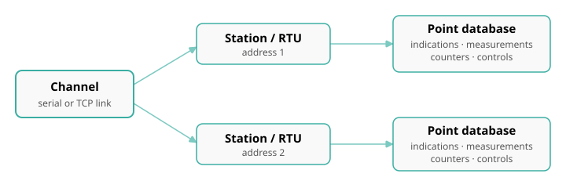

# Concepts

Every tool in the suite is built on the same three-level model. Learn it once
and every protocol tool feels familiar.

## Channel

A **channel** is one communication link: a serial port (COM, with baud /
parity / stop bits) or a network endpoint (TCP or UDP host and port, optionally
with TLS). A tool can run many channels at once, each independent, each started
and stopped on its own.

- In a **Master** tool the channel connects out to (or listens for) the devices
  it polls.
- In a **Slave** tool the channel is the port the tool listens on (or the serial
  line it answers), simulating one or more RTUs.

## RTU / Station / Outstation

Behind a channel are one or more **stations** — the addressable devices. The
name changes with the protocol but the idea is identical:

| Protocol | Station term | Address |
|---|---|---|
| Modbus | Device / Unit | Unit ID |
| DNP3 | Outstation | Link address |
| IEC 104 / 101 | Station | Common (ASDU) address — IEC 101 also has a link address |

One channel can carry several stations (a multi-drop serial line, or several
common addresses on one connection).

## Point

Each station owns a **point database** — the individual data items. Points are
grouped by kind, and the kinds map onto each protocol's object model:

- **Indications / binary inputs** — on/off status.
- **Measurements / analog inputs** — numeric values.
- **Counters** — accumulators.
- **Controls / outputs** — command targets (commands, setpoints, relay outputs).

In a Master tool the points hold the values **received** from the device; in a
Slave tool they hold the values the simulated RTU **serves**, and you can edit or
simulate them.

## Master vs Slave

- A **Master** initiates: it polls, reads, and sends commands, and displays what
  comes back.
- A **Slave** responds: it answers polls and commands as a device would, from the
  point database you configure, and can emit spontaneous events.

## Workspace

Everything you configure — channels, stations, points, schedules, simulation —
is saved in a single **workspace** file, so you can reopen a whole test setup
later or move it to another machine. See
[Workspaces](../shared/workspaces.md).
