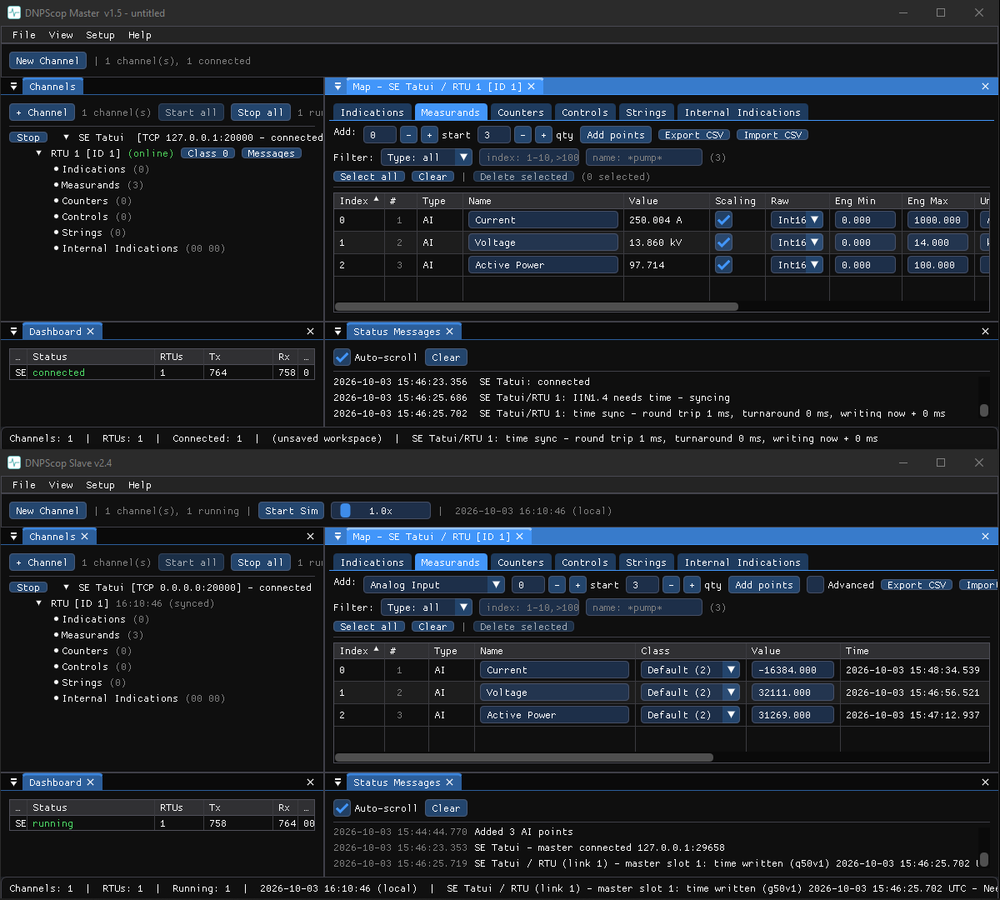

# First run

This walk-through gets a Master talking to a Slave on your own machine, with no
hardware, in a few minutes. We use the DNP3 pair, but the shape is the same for
every protocol.

## 1. Start a simulated RTU (the Slave)

1. Open **DNPScop Slave**.
2. In the **Channels** window click **+ Channel**. Choose **TCP**, keep the
   listening port at `20000`, and give the outstation a link address (for
   example `10`). Click **OK**.
3. Right-click the RTU → **Points…** and add a few binary inputs and analog
   inputs so there is something to read.
4. Click **Start** on the channel. The Slave is now listening.

## 2. Start a Master and point it at the Slave

1. Open **DNPScop Master**.
2. **+ Channel** → **TCP**, host `127.0.0.1`, port `20000`, outstation link
   address `10`, master address `1`. Click **OK**.
3. Click **Start**. The Master connects and runs its start-up sequence.

## 3. Watch it work

- The Master's point map fills with the values the Slave serves.
- Open **View → Communication Monitor** in either tool to see the frames,
  decoded layer by layer. See [Communication Monitor](../shared/monitor.md).
- Change a value in the Slave's point table and watch it arrive in the Master on
  the next poll (or as an event).

## 4. Save your setup

**File → Save Workspace** stores the channels, stations and points so you can
reopen this exact setup later. See [Workspaces](../shared/workspaces.md).

!!! tip "One shell for everything"
    Instead of launching tools separately you can run **SCADAScop**, which embeds
    every Master and Slave and adds a single Communication Monitor across all
    protocols. See [SCADAScop](../protocols/scadascop.md).
