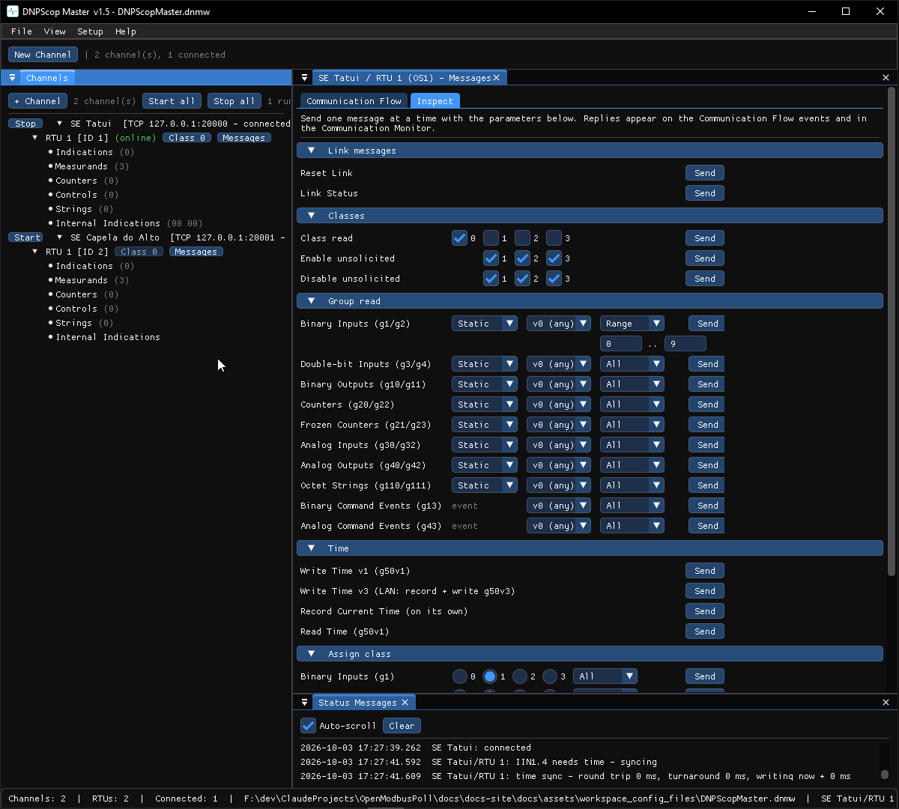

# Inspect (one-shot messages) — DNP3

The DNPScop Master **Inspect** tab sends one message at a time with its
parameters chosen inline. It is the quickest way to poke an outstation without
touching the poll schedule.

1. Right-click the outstation → **Messages…** and open the **Inspect** tab.
2. Find the message you want and set its parameters:
    - **Group read** — pick **Static / Event**, a **variation** (`v0 (any)` is
      the safe default), and a **range**:
        - **All** — every object.
        - **Range** — indices *start*..*stop* (a single point: set them equal).
        - **Count** — the first *N* objects.
        - **List** — explicit indices, comma-separated.
    - **Classes** — tick the classes for a class read, or enable/disable
      unsolicited.
    - **Time** — write time (v1 or the LAN v3 record+write), or read time.
    - **Assign class** — pick one class and All/Range for a static group.
3. Click **Send**. The request and the outstation's reply appear in the
   **Communication Flow** events and the
   [Communication Monitor](../shared/monitor.md).

!!! note
    The channel must be started. Offline, the Send buttons are disabled.
