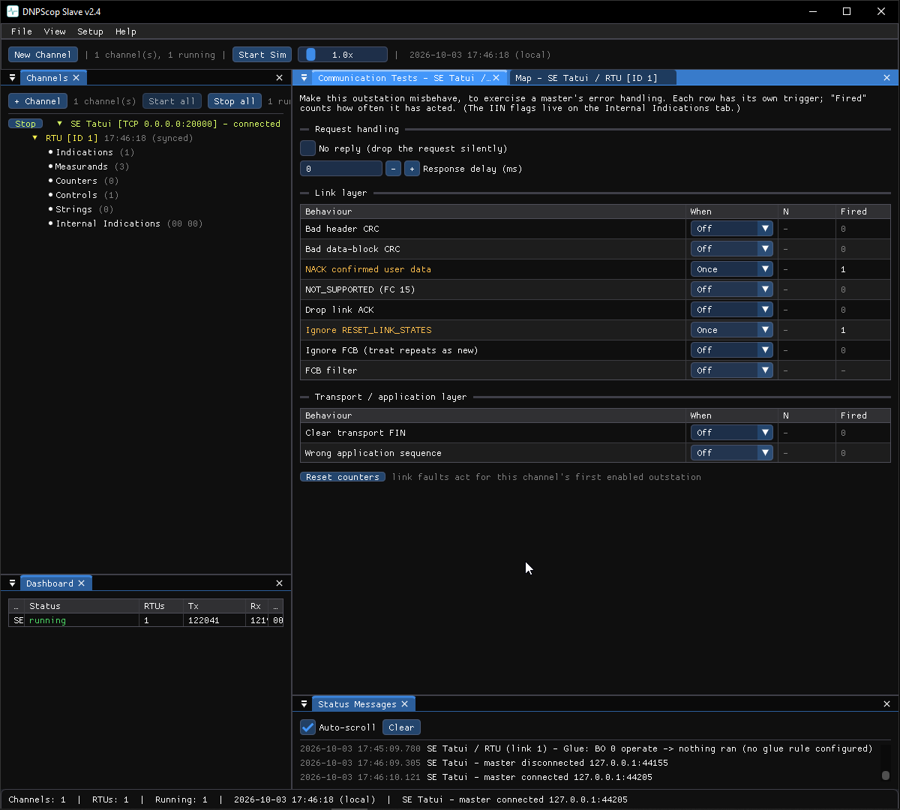

# Simulate faults

The Slave tools can make a simulated device **misbehave on purpose**, to test how
a master copes. DNP3 and the IEC tools have a dedicated panel.

## Where it is

- **DNP3 / IEC 101 / IEC 104 Slave** — right-click an RTU → **Communication
  Tests…** (right below *Settings*).

## Triggers

Every fault has its own trigger and a live **Fired** count:

- **Off** — disabled.
- **Always** — on every matching frame.
- **Once** — the next matching frame only.
- **Every Nth** — every *N*th matching frame.

**Reset counters** clears the counts (not the triggers).

## What you can inject

- **Application layer (IEC)** — negative confirmation (the request is rejected
  and **not** executed), drop the activation confirmation / termination, answer
  with COT 44 (unknown type), wrong common address.
- **IEC 101 link layer** — deny class 2 / class 1, NACK, link-not-functioning
  (FC 14), link busy (DFC = 1), silent, bad checksum, ignore FCB, FCB filter.
- **IEC 104 APCI** — ignore STARTDT / TESTFR, hold back acknowledgements, corrupt
  N(S), wrong APCI length, drop the connection.
- **DNP3 link** — bad header / block CRC, NACK, NOT_SUPPORTED, drop ACK, ignore
  reset, ignore FCB, FCB filter; **transport/app** — clear FIN, wrong app
  sequence.

Affected frames are tagged `[fault]` in the
[Communication Monitor](../shared/monitor.md).
