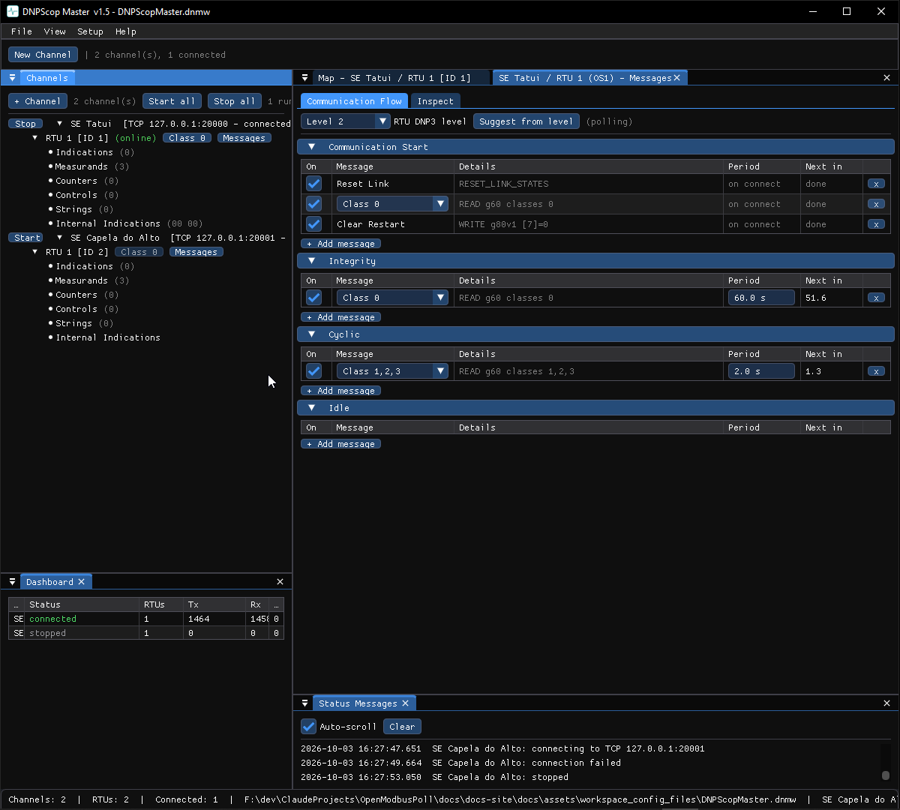

# DNP3

DNPScop is the DNP3 (IEEE 1815) pair: **DNPScop Master** (the control-centre
side) and **DNPScop Slave** (the outstation). This chapter covers what is
specific to DNP3; the shared windows (Channels, Monitor, PCAP, workspaces) are
in [Using the tools](../shared/channels.md).

## Addressing

A DNP3 channel carries one or more **outstations**, each identified by a **link
address**; the master has its own link address too. On the Master side you set
the master address and the outstation address per channel.

## Points

DNP3 points are grouped by object group, shown on category tabs:

- **Indications** — Binary Input (g1/g2), Double-bit Input (g3/g4).
- **Measurands** — Analog Input (g30/g32), with per-point variation and
  deadband.
- **Counters** — Counter (g20/g22) and Frozen Counter (g21/g23).
- **Controls** — Binary Output / CROB (g10/g11/g12), Analog Output (g40/g41/g42).
- **Strings** — Octet String (g110/g111).
- **Internal Indications** — the IIN bits (its own tab; see below).

Each point has a **class** (0/1/2/3) that decides how it is reported.

---

## DNPScop Master

### Start-up and polling

When a channel starts, the Master runs a configurable start-up sequence
(clear restart, time sync, integrity poll) and then its scheduled polls. The
schedule lives in the **Messages** window.

### Messages window

Right-click an outstation → **Messages…**. The window has two tabs.

#### Communication Flow

The scheduled messages, grouped by phase — **Communication Start** (one-shots on
connect), **Integrity**, **Cyclic** and **Idle**. Each row is a message with an
enable checkbox, parameters, a period and a countdown. Pick an **RTU DNP3 level**
and **Suggest from level** to seed a sensible schedule. Use **+ Add message** to
add a class poll, a group read (with variation), a time sync or an ASSIGN_CLASS.

#### Inspect

The **Inspect** tab sends **one message at a time** with its parameters chosen
inline — a bench for poking an outstation. Each row has a **Send** button.

- **Link messages** — Reset Link, Link Status.
- **Classes** — Class read (Class 0/1/2/3), Enable / Disable unsolicited
  (Class 1/2/3).
- **Group read** — one row per family (Binary, Double-bit, Binary Output,
  Counters, Frozen Counters, Analog, Analog Output, Octet Strings, Binary and
  Analog command events). Each row has:
    - a **Static / Event** toggle (picks e.g. g1 vs g2),
    - a **variation** combo (`v0 (any)` plus the family's variations),
    - a **range** selector — **All**, **Range** start..stop, **Count** (first N)
      or **List** of indices.
- **Time** — Write Time v1 (g50v1), Write Time v3 (LAN: record + write g50v3), a
  standalone Record Current Time, and Read Time.
- **Assign class** — per static group, a single-class radio (0/1/2/3) and
  All/Range.

Replies appear on the Communication Flow events and in the
[Communication Monitor](../shared/monitor.md).

See the walk-through in [Inspect (one-shot messages)](../how-to/inspect-messages.md).

### Sending controls

From the point map, operate a control point (CROB / analog output) with
Direct-Operate or Select-before-Operate. See
[Send a control](../how-to/send-a-control.md).

### Automatic reactions

The Master can react to the outstation's IIN bits: clear a reported restart
(IIN1.7 → WRITE g80), sync the clock on IIN1.4, re-poll on buffer overflow
(IIN2.3), and so on. These are per-outstation settings.

---

## DNPScop Slave

### Simulating an outstation

Add outstations to a channel, give each a link address and points, and start the
channel. Edit point values in the map to drive the data the master reads;
event-class points generate events, optionally delivered unsolicited.

### Internal Indications tab

The point window has an **Internal Indications** tab where you view and manually
set the IIN bits, per master/buffer slot — useful for making a master handle a
restart, need-time, or buffer-overflow indication.

### Communication Tests window

Right-click an outstation → **Communication Tests…** (right below Settings) opens
the fault-injection panel. Each fault has its own trigger (Off / Always / Once /
Every Nth) and a live *Fired* count:

- **Request handling** — No reply (drop the request), Response delay.
- **Link layer** — bad header CRC, bad data-block CRC, NACK confirmed user data
  (FC 1), NOT_SUPPORTED (FC 15), drop the link ACK, ignore RESET_LINK_STATES,
  ignore FCB, FCB filter (only accept FCB = 0 / 1).
- **Transport / application** — clear the transport FIN, wrong application
  sequence number.

(The IIN flags are **not** here — they have their own Internal Indications tab.)

See [Simulate faults](../how-to/simulate-faults.md).

---

## Timeouts and parameters

The channel **Settings…** dialog carries the DNP3 timers and sizes — link
confirm mode and timeout, application fragment size, control index qualifier
(0x28 / 0x17) — alongside the shared auto-reconnect, RS-485 and TLS options.
