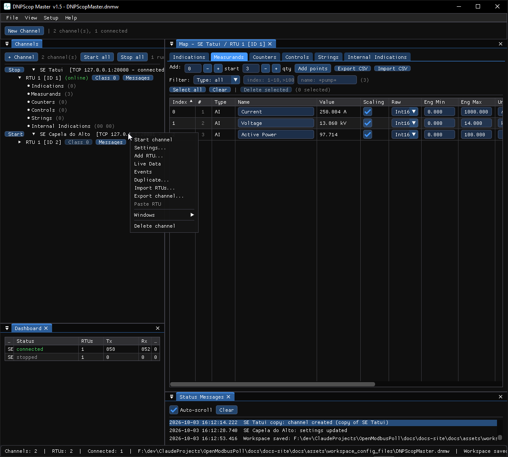

# Channels window

The **Channels** window is the home of every tool: a tree of the channels you
have configured, each with its stations below it. It is where you create, start,
stop and configure links.

## The toolbar

- **+ Channel** — create one or more channels (see
  [Fan-out and duplicate](fanout.md) for creating many at once).
- **Start all** / **Stop all** — start or stop every channel. The File menu has
  the same commands; SCADAScop adds <kbd>Ctrl</kbd>+<kbd>Shift</kbd>+<kbd>S</kbd>
  / <kbd>Ctrl</kbd>+<kbd>Shift</kbd>+<kbd>X</kbd> and asks before stopping more
  than one running channel.
- A running count shows how many channels are started.

## A channel row

Each row shows the **Start/Stop** button, the channel name, and its endpoint
(for example `COM3 9600 8E1` or `127.0.0.1:20000`). Starting a channel opens the
link (or begins listening); stopping it closes the link.

Right-click a channel for its context menu:

- **Start / Stop channel**
- **Settings…** — endpoint, link / protocol parameters, timeouts, TLS,
  auto-reconnect and RS-485 options.
- **Duplicate…** — copy the whole channel with its stations (see
  [Fan-out and duplicate](fanout.md)).
- **Export channel…** / **Import Channels…** — move channels between tools or
  files.
- **Delete channel**
- **Communication Monitor (this channel)** — open the monitor filtered to it.

## A station (RTU) row

Under each channel sit its stations. Right-click one for:

- **Points…** — open the point database window.
- **Settings…** — the station's address, name and per-station options.
- **Communication Tests…** *(DNP3 / IEC slaves)* — the fault-injection panel;
  see [Simulate faults](../how-to/simulate-faults.md).
- **Duplicate RTU…**, **Export RTU…**, **Copy / Paste RTU**, **Delete RTU**.

## Connection settings

The **Settings…** dialog carries the options shared by every tool:

- **Endpoint** — serial parameters or host/port.
- **Auto-reconnect** — a dropped TCP connection or a vanished serial port
  reopens by itself with a back-off (`AutoReconnect`, `ReconnectMin`,
  `ReconnectMax`).
- **RS-485 RTS** — toggle, inverted toggle or always-on RTS for 2-wire lines
  (`RtsMode`, `RtsDelay`).
- **Local interface** (master channels, TCP / UDP) — the network adapter of
  the PC the connection leaves from, chosen by its IP address
  (`LocalInterface`). Leave it empty and the operating system chooses by its
  routing table. Set it on a PC with several adapters in the same network,
  when the traffic goes out through the wrong one: pick the address from the
  drop-down (it lists every adapter with its name) or type it. The line below
  the field names the adapter, or warns that no adapter of the PC has that
  address. If the address is missing when the channel starts (cable moved,
  DHCP gave another address), the connection fails with a line in Status
  Messages; it never falls back to another adapter. The P2P Monitor has the
  same field for its RTU side.
- **TLS** — see [TLS](tls.md).
- **Timeouts and retries** — protocol-specific, documented in each protocol
  chapter.
