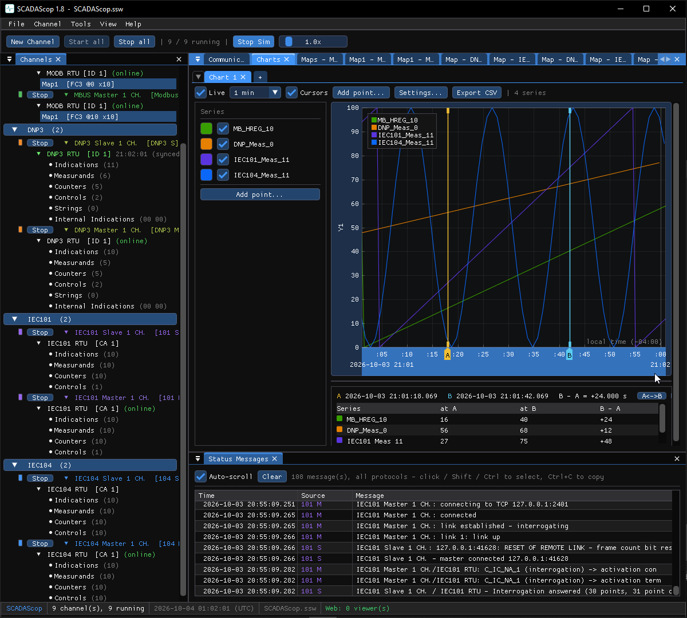

# Charts

The **Charts** window plots point values over time, so you can watch a measurand
ramp, compare two analogs, or confirm that a control actually moved a value.

## Opening the window

**Tools → Charts** opens one Charts window that serves every master channel in
the tool (and, in **SCADAScop**, every embedded tool at once). You do not open a
separate chart per point — one window holds as many charts as you add.

## Adding points

Put a point on a chart in either way:

- **Right-click a point** in a point map / live data view → **Add to chart**.
- **Drag and drop** a row from any embedded tool onto a chart.

Measurands and indications from **DNP3, IEC 60870-5 and Modbus** can share the
same time axis, so data from different protocols lines up on one chart.

## Working with a chart

Each chart has a small toolbar:

- **Live follow** — keep the newest data in view as it arrives.
- **Time window** — how much history to show.
- **Add point… / Settings** — add series or adjust the chart.

Charts, their series and their settings are saved in the
[workspace](workspaces.md) (`.ssw`), so a saved layout comes back with its
charts intact.

!!! tip "Pair charts with simulation"
    Turn on [Simulation](simulation.md) on the slave side and speed time up to
    draw a full curve in seconds while you set a chart up.
