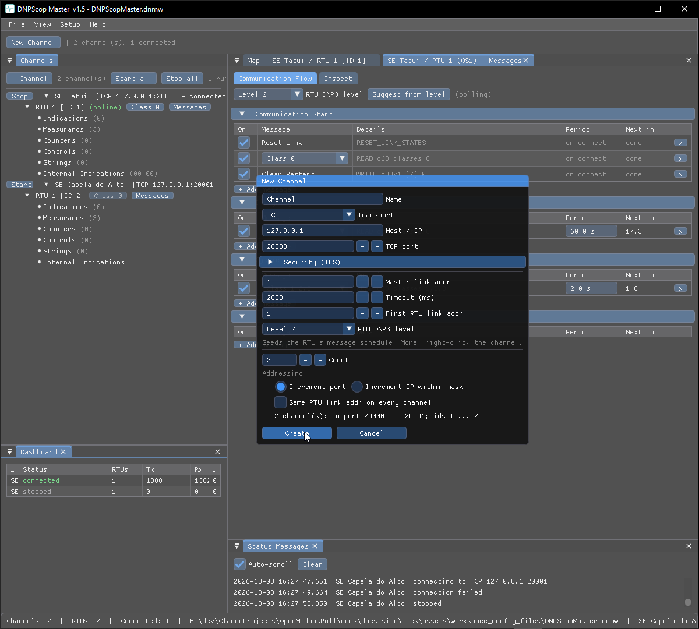

# Fan-out and duplicate

Building a large test set is fast: create many channels at once, and duplicate
channels or RTUs with their addresses stepped automatically.

## Create many channels at once

The **New Channel** dialog (every tool, and the P2P Monitor) can create up to
**64** channels in one go. Set **Count > 1** and an **Addressing** block decides
how channel *i* differs from the first:

- **Masters over TCP/UDP** — *Increment port* (same host, port + i) or
  *Increment IP within mask* (IP + i inside a chosen network; the network and
  broadcast addresses are skipped).
- **Slaves** — increment the listening port on the same bind address.
- **Serial** — increment the COM number (COM3, COM4, …).

The RTU / link / unit / common address steps with the channel unless **Same … on
every channel** is ticked. Names become `<name> 1`, `<name> 2`, … (or
`<name> <ip>`). The dialog previews the resulting range and reduces the count if
it would run past the mask, the port range or the id range.

## Duplicate a channel

Right-click a channel → **Duplicate…** copies the whole channel — endpoint, TLS,
link parameters and every RTU with its points, schedules, simulation and glue —
with the same **Copies + Addressing** block, seeded from that channel. Copies
start stopped.

## Duplicate an RTU

Right-click an RTU → **Duplicate RTU…** copies one station inside its channel —
all points and their settings — under a new address (**Copies** + **Next id**;
ids already used on the channel are refused).

!!! note "SCADAScop"
    In SCADAScop the copies land in the source channel's group, and a P2P batch
    steps both legs at once.
