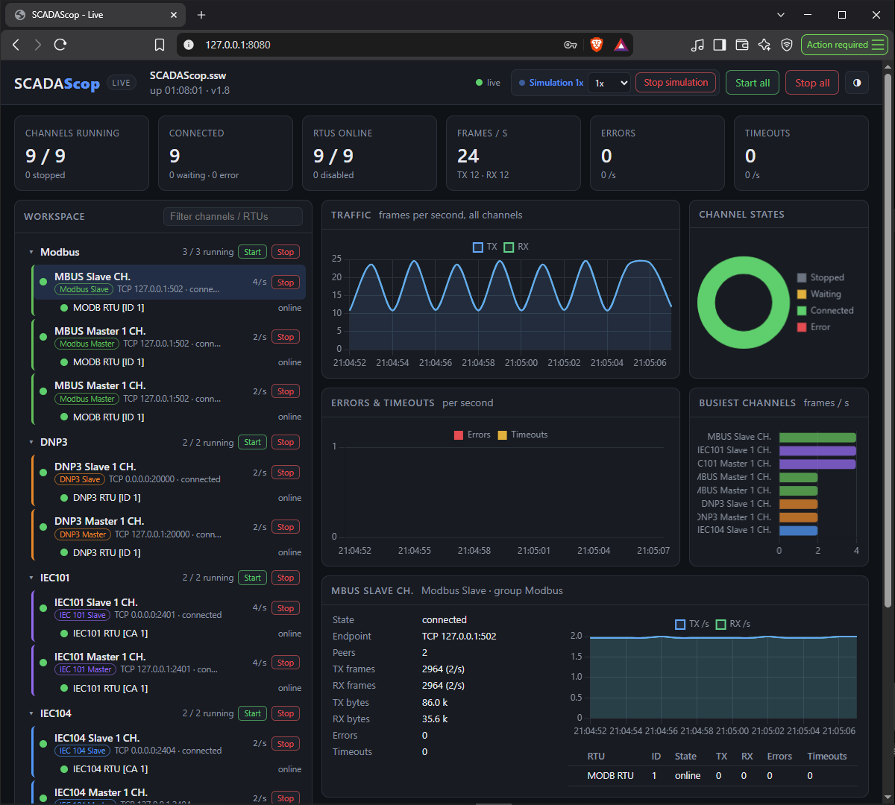

# Headless and the web interface

**SCADAScop** can run with **no window at all** — load a workspace, start its
channels and keep them running on a server, a CI job or a bench rig — and
optionally expose a small **web interface** so you can watch it from a browser.

## Running headless

```
SCADAScop.exe --headless plant.ssw --start-all --web 8080
```

That loads `plant.ssw`, starts every channel and serves the web UI at
`http://127.0.0.1:8080/`. No GUI is created.

Useful switches (GUI and headless unless noted):

| Switch | What it does |
|---|---|
| `--headless <file.ssw>` | run with no window |
| `--start-all` | start every channel after loading (slaves → P2P → masters) |
| `--run <seconds>` | stop and exit after this long |
| `--tick <ms>` | loop period (default 20) |
| `--sim [speed]` / `--no-sim` | run / force off the slave [simulation](simulation.md) (0.1–10×) |
| `--log <file>` | append the Status Messages to a file |
| `--summary <s>` / `--quiet` | console summary interval / silence the console |
| `--cpu` / `--gpu` | GUI renderer (see [Install](../getting-started/install.md)) |

Pressing **Ctrl+C**, closing the console, or reaching `--run` stops the channels
in order (masters → P2P → slaves) and exits. If `--web` is given but the port is
busy, the process exits with code 3.

Headless mode also keeps memory flat: the per-channel display logs that only a
window would show are skipped, so a long-running headless process stays lean.

## The web interface



The same web UI is available from the GUI under **Tools → Web Interface…**, where
you can Start / Stop it, copy the link, open it in a browser and see the viewer
count. You choose who may reach it — **this computer** (127.0.0.1), **any
computer on the network** (0.0.0.0) or **one address** — set the **port** and an
optional **access token**, and whether it is **monitoring-only** and starts with
SCADAScop. While it runs the status bar shows *Web: N viewer(s)*.

The page shows the groups, channels and RTUs with their state and counters, a
live Status Messages feed, and — when the workspace has a slave tool — a
**simulation** box (state, speed and Start / Stop). In monitoring-only mode the
controls are hidden and nothing can be changed.

## Security

- The server binds to **127.0.0.1 only** by default.
- Binding to any other address **without** a token generates a random one (shown
  as `?token=…`); the API needs it in the `X-Scop-Token` header or as `?token=`,
  and a missing or wrong token returns 401.
- Commands require an extra header and are refused entirely in monitoring-only
  mode. The page loads nothing from outside the executable.

!!! note "Expose it deliberately"
    Leave the bind at 127.0.0.1 unless you need remote access; when you do open it
    to the network, set a token and prefer monitoring-only for a view-only link.
