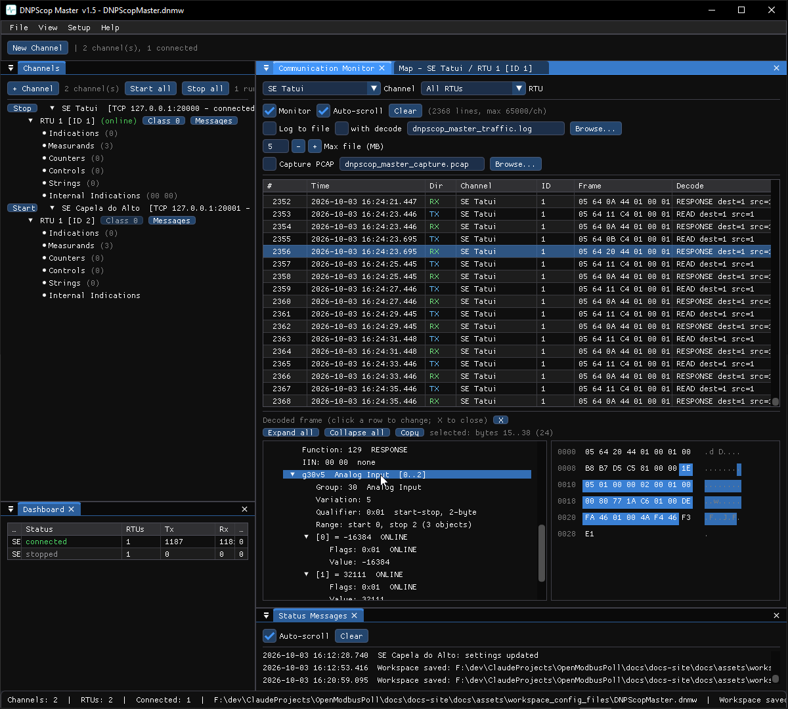

# Communication Monitor

The **Communication Monitor** shows the traffic on a channel — every frame, in
both directions, with a decoded summary — and can capture it to a PCAP file.
Open it from **View → Communication Monitor**, or right-click a channel →
**Communication Monitor (this channel)**.

## Columns

| Column | Meaning |
|---|---|
| Time | Wall-clock time the frame was sent or received, to the millisecond. |
| Dir | Direction — transmit or receive. |
| Front-end / Channel / RTU | Who the frame is to/from. |
| Frame | The raw bytes, in hex. |
| Decode | A one-line summary of the frame (function, cause, address, object count…). |

Click a row to see the **layered decode** in the detail pane: the link layer,
the application header, and every object expanded with its value, quality and
time tag — enough to read the wire without any other tool.

## Filters and controls

- Filter by **direction**, **channel**, **RTU** and **free text**.
- **Pause** freezes the view while traffic keeps being logged.
- **Auto-scroll** keeps the newest row in view.
- Each monitor writes its own **rotating log file**.

## Fault tags

When a fault-injection option is active (see
[Simulate faults](../how-to/simulate-faults.md)), the frames it affects are
tagged `[fault]` in the Decode column, so an injected bad checksum or suppressed
reply is easy to spot.

## SCADAScop: one monitor for every protocol

In SCADAScop, **View → Communication Monitor** shows the traffic of every
embedded tool in one table, with an extra **Tool** column and filters by tool.
Mixed-protocol PCAP works too — each flow keeps its protocol's well-known port
so Wireshark dissects them all correctly. **New monitor** opens further
instances with their own filters and capture. See [PCAP capture](pcap.md).
