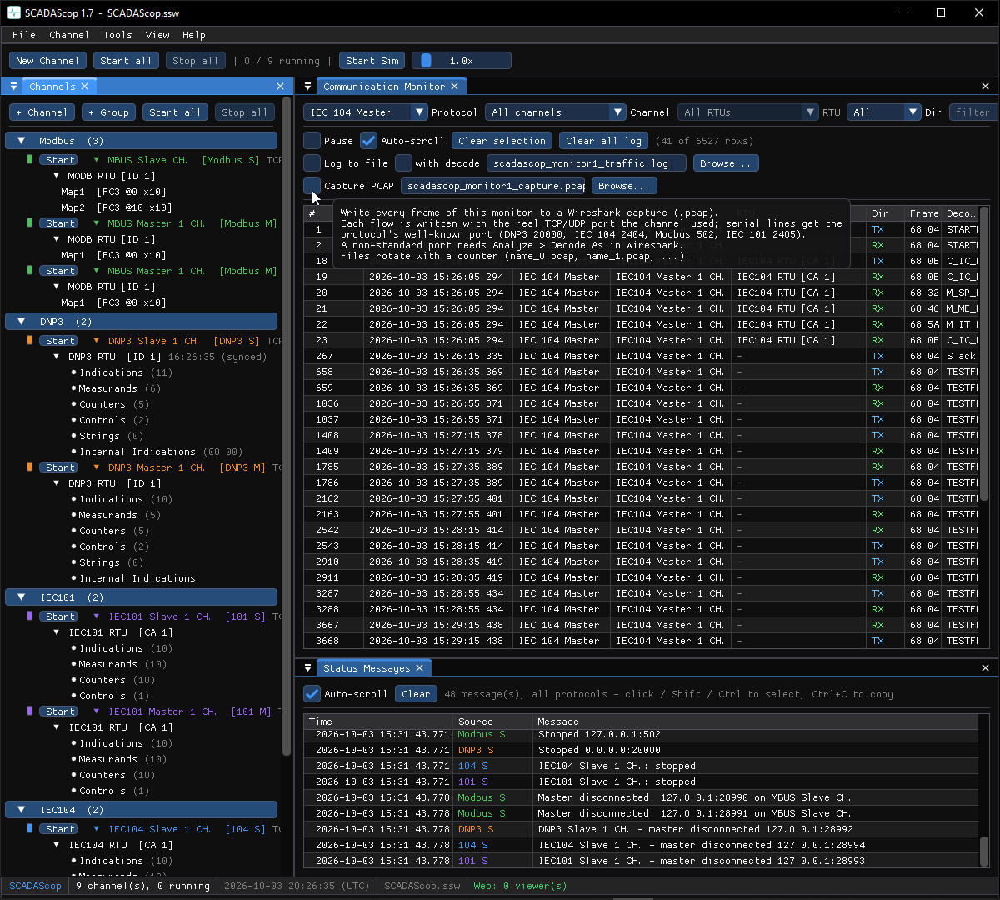

# PCAP capture

Any Communication Monitor can record the traffic to a **PCAP** file that opens
directly in [Wireshark](https://www.wireshark.org/).

## Capturing

1. Open the Communication Monitor for the channel (or the unified monitor in
   SCADAScop).
2. Start the capture and choose a file.
3. Reproduce the traffic you want to record.
4. Stop the capture and open the file in Wireshark.

## How frames are framed for Wireshark

Each flow is written with its protocol's **well-known port** so Wireshark picks
the right dissector automatically:

- DNP3 → TCP 20000
- IEC 60870-5-104 → TCP 2404
- Modbus → TCP 502
- Serial protocols (IEC 101) are encapsulated so their frames are
  preserved for inspection.

In SCADAScop a single capture can hold **several protocols at once**, each on its
own port, and Wireshark dissects each correctly in the one file.

!!! tip "Captures are great for bug reports"
    A short PCAP that reproduces a problem is the fastest way to show exactly
    what went over the wire.
