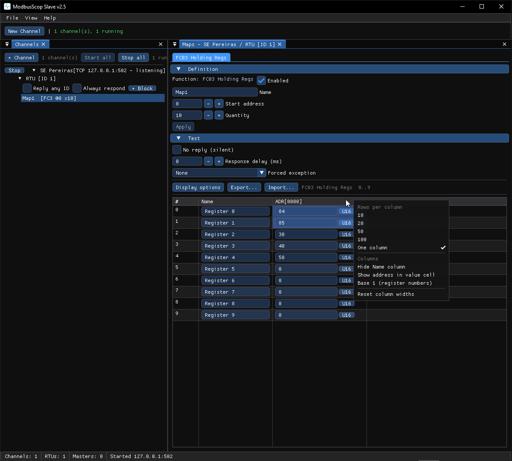

# Points and maps

Every station has a **point database** — the data items it serves (Slave) or has
received (Master). Open it from the Channels window: right-click a station →
**Points…**, or double-click a category.

## Category tabs

Points are grouped into tabs by kind — Indications, Measurands/Analogues,
Counters, Controls, and (where the protocol has them) Strings. The exact tabs and
columns depend on the protocol; the protocol chapters describe them.

## Editing points

- **Add** points with the add-row at the top (kind, start address, quantity).
- Edit a value inline; in a **Slave** this changes what the simulated RTU serves
  and, when started, emits an event. In a **Master** the values are read-only —
  they reflect what the device reported.
- **Name** a point to label it in tables, charts and the monitor.
- **Select** rows (click, <kbd>Ctrl</kbd>+click, <kbd>Shift</kbd>+click, drag a
  box, <kbd>Ctrl</kbd>+<kbd>A</kbd>) to delete or bulk-edit; <kbd>Ctrl</kbd>+<kbd>C</kbd>
  copies the selection as text.

## Column options (Modbus)

In the Modbus tools the register/coil grids are resizable — drag a column
border, and the Name field grows with it. **Right-click a column header** for:

- **Rows per column** — how the grid wraps.
- **Hide Name column**
- **Show address in value cell**
- **Base 1 (register numbers)** — show PLC-style register numbers (address + 1).
- **Reset column widths**

## CSV import / export

The point tables export to and import from CSV, so you can build a large point
list in a spreadsheet and load it in. The header row names the columns; unknown
columns are ignored.
