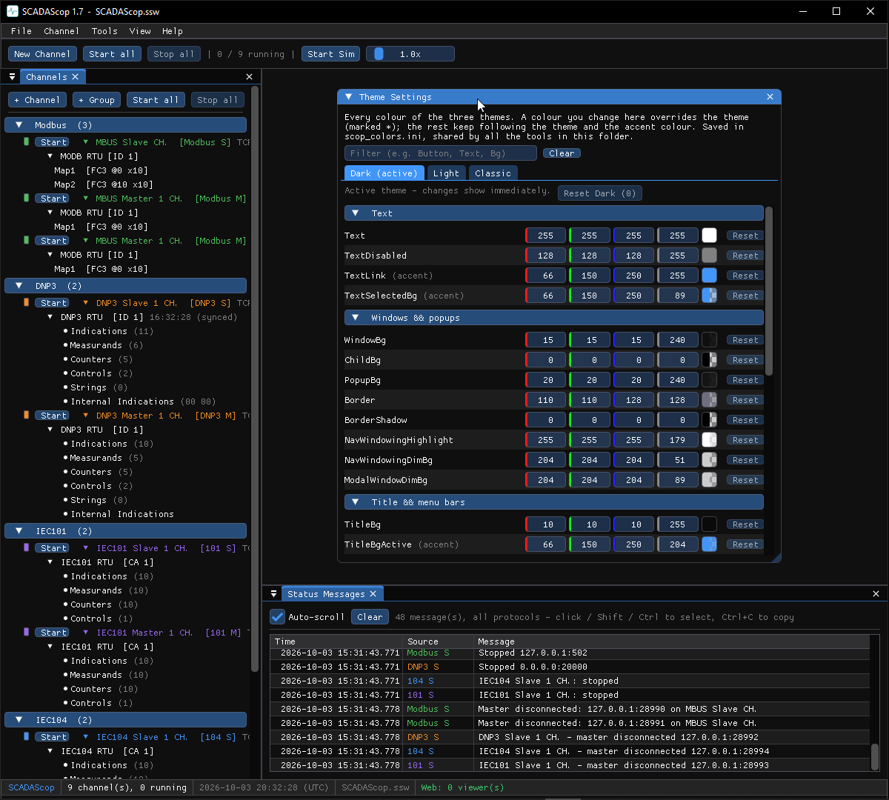

# Themes

Every tool has **Dark**, **Light** and **Classic** themes, an accent colour, and
a full per-colour override editor. The choice is saved and shared by every tool
started from the same folder.

## Switching

**View → Theme** picks Dark / Light / Classic and the accent colour. The change
applies immediately.

## Theme Settings

**View → Theme → Settings…** opens an editor listing every colour of the three
themes — text, backgrounds, borders, title and menu bars, frames, buttons,
headers, tabs, tables, plots and more — grouped and filterable, with one tab per
theme.

- Change a colour to **override** the theme (marked `*`), with a per-colour and a
  per-theme **Reset**.
- Colours you leave alone keep following the theme and the accent.

Overrides are saved in `scop_colors.ini` next to the tools' other settings and
are shared by every tool started from that folder.
