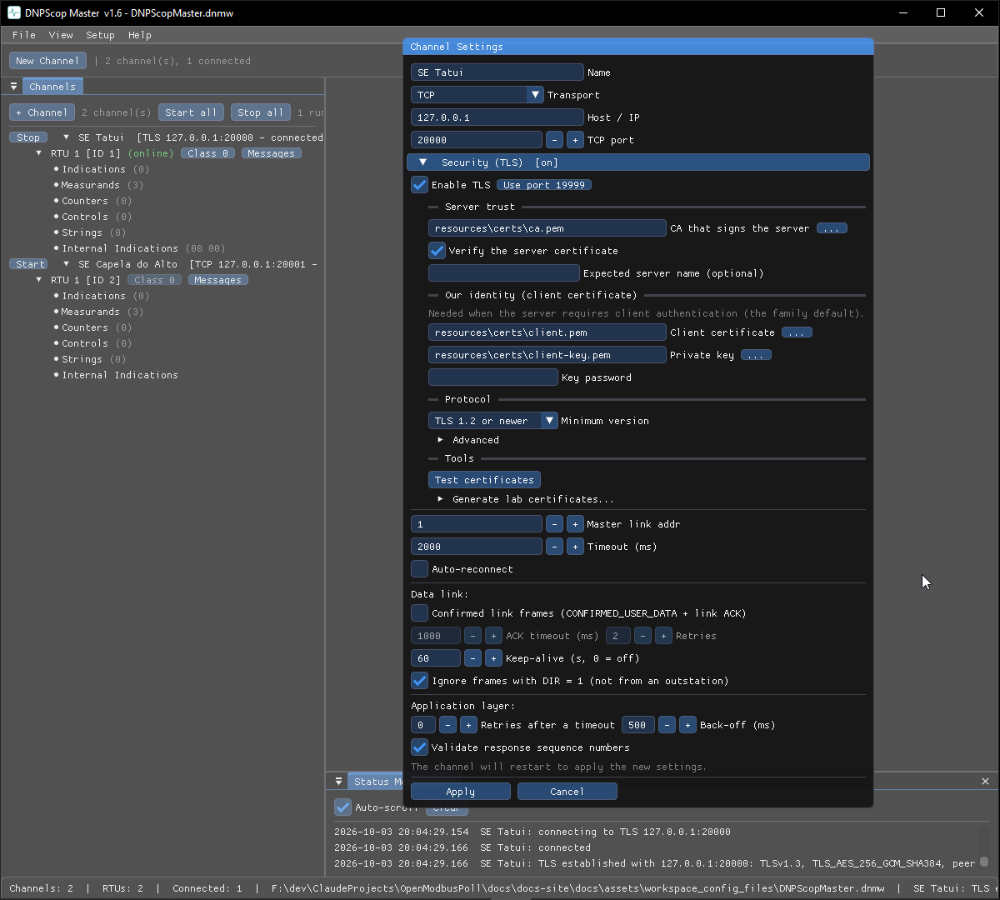

# TLS

TCP channels can run over **TLS**. Set it up in the channel's **Settings…**
dialog, under the Connection / TLS section, before starting the channel.

## Turning it on

1. Open the channel **Settings…**.
2. Enable **TLS** and point it at the certificate and key (server side) or the
   CA / trust settings (client side).
3. Start the channel. Once the handshake completes, the tool shows the session
   details — protocol version, cipher and peer identity — and logs handshake
   events to the status log and the monitor.

## Lab certificates

For trying TLS without a PKI, a release archive includes:

- `resources\certs\` — ready-made demo certificates.
- `tools\New-ScopLabCerts.ps1` — a PowerShell script that generates a small set
  of lab certificates (a CA and server/client certs) you can point the tools at.

!!! warning "Demo certificates are for the lab only"
    The bundled certificates exist so you can exercise the TLS path. Use your own
    PKI for anything real.
