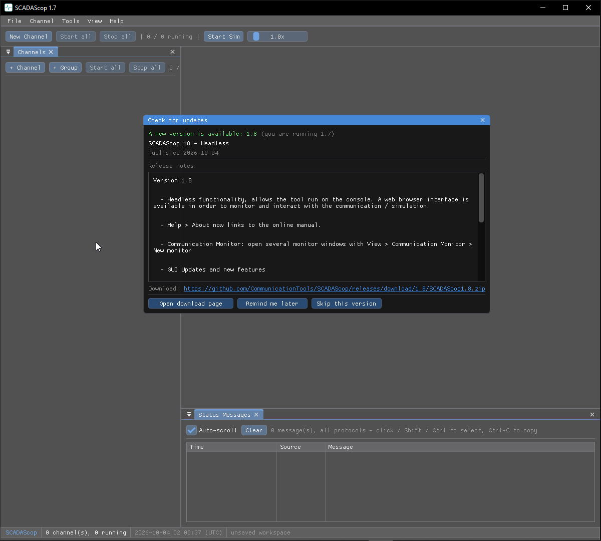

# Updates

The public tools can check GitHub for a newer release.

## Checking

**Help → Check for updates…** asks GitHub for the latest release of that tool's
repository under [github.com/CommunicationTools](https://github.com/CommunicationTools),
compares it with the running version, and — when a newer one exists — shows the
release name, date and notes with:

- **Open download page** — the release's single archive, or the release page.
- **Remind me later**
- **Skip this version** — remembered so you are not asked again for it.

A silent check also runs once a day at startup and only speaks up when a newer
version exists. Turn it off with **Help → Check for updates at startup**.

Nothing is downloaded or installed by the tool itself — your browser does the
download. On Windows the request uses the system certificate store and proxy
settings (WinHTTP), like your browser.

!!! note
    Inside SCADAScop only the shell checks, for itself; the embedded tools stay
    quiet.
