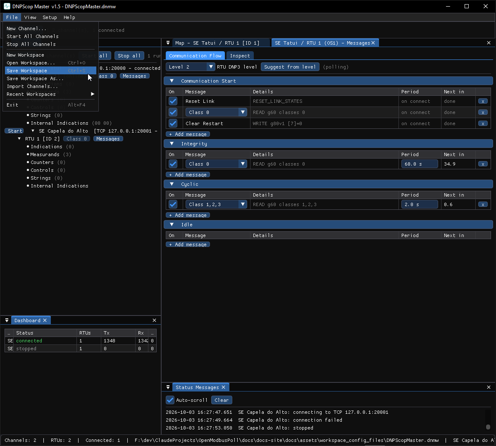

# Workspaces

Everything you configure in a tool — channels, stations, points, schedules,
simulation, glue logic — is saved in a single **workspace** file, so a whole
test setup reopens exactly as you left it, or moves to another machine.



## Save and load

- **File → Save Workspace** / **Save Workspace As…**
- **File → Open Workspace**
- **File → New Workspace** starts fresh.

Each tool uses its own extension (for example `.dnsw`-style per tool); SCADAScop
writes one self-contained `.ssw` that carries every embedded tool's channels.

## Format 2 (plain text)

Workspaces use a plain-text, human-readable grammar (see
[Workspace keys](../reference/workspace-keys.md)):

```
[Workspace] Format=2
[Channel] Tool=DNP3  Name=...  Running=1  <endpoint / link / TLS keys>
  [Rtu] Proto=DNP3  Addr=10  Name=...  <station keys>
    [Points] ...
```

Containment is by order, unknown keys are ignored, and a block only needs the
keys that differ from the defaults — so a headless configuration can be written
by hand. Masters save `Running=` too, so a master workspace restarts its
channels on load.

!!! warning "Older workspaces are not read"
    The tools only read format 2. A workspace written by an older version is
    rejected with a message; there is no automatic converter.

## Moving pieces between tools

You do not have to save and reload whole workspaces to move configuration:

- **Export / Import channel** and **Export / Import RTU** write `.ssc` / `.ssr`
  files.
- **Copy / Paste RTU** uses the clipboard as plain text, so it works between two
  running tools, and even to and from a text editor.

See [Fan-out and duplicate](fanout.md) for creating many channels or RTUs at
once.
